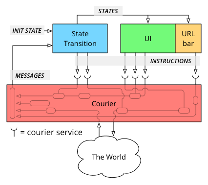

Minimal Courier architecture example
====================================

The repository demonstrates a minimal example of a client architecture
described briefly in
http://baatz.io/posts/courier-reactive-react-architecture/, using reactive
programming (dataflow) and  immediate mode UI rendering:

This example uses Kefir and React, but you can use whichever libraries you
prefer.

    npm install .
    npm build
    open dist/index.html

If you want to experiment, you do `node_modules/gulp/bin/gulp.js watch` to run
a watcher. You can also get live reload with the LiveReload [Chrome
extension](https://chrome.google.com/webstore/detail/livereload/jnihajbhpnppcggbcgedagnkighmdlei).
